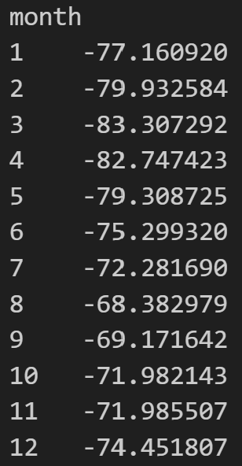
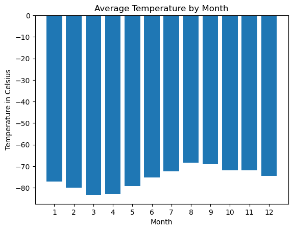
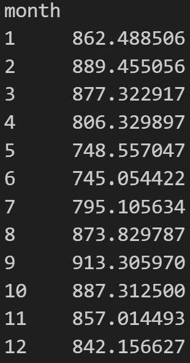
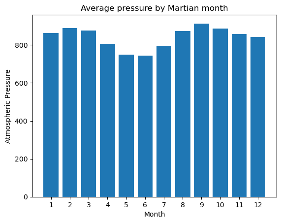
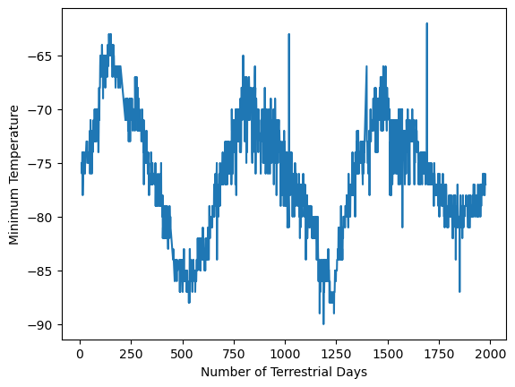

# webscraping-challenge

I am Andrea Ceriati, and this week I worked on the following assignment:

# What You're Creating

This new assignment consists of two technical products. You will submit the following deliverables:

Deliverable 1: Scrape titles and preview text from Mars news articles.

Deliverable 2: Scrape and analyze Mars weather data, which exists in a table.

# Instructions

## Part 1: Scrape Titles and Preview Text from Mars News

Open the Jupyter Notebook in the starter code folder named ```part_1_mars_news.ipynb```. You will work in this code as you follow the steps below to scrape the Mars News website.

1. Use automated browsing to visit the Mars news siteLinks to an external site. Inspect the page to identify which elements to scrape.

2. Create a Beautiful Soup object and use it to extract text elements from the website.

3. Extract the titles and preview text of the news articles that you scraped. Store the scraping results in Python data structures as follows:

- Store each title-and-preview pair in a Python dictionary and, give each dictionary two keys: ```title``` and ```preview```. An example is the following:

```py

{'title': "NASA's MAVEN Observes Martian Light Show Caused by Major Solar Storm", 
 'preview': "For the first time in its eight years orbiting Mars, NASA’s MAVEN mission witnessed two different types of ultraviolet aurorae simultaneously, the result of solar storms that began on Aug. 27."}
 
 ```

- Store all the dictionaries in a Python list.

- Print the list in your notebook.

4. Optionally, store the scraped data in a file (to ease sharing the data with others). To do so, export the scraped data to a JSON file. (Note: there will be no extra points for completing this.)

## Part 2: Scrape and Analyze Mars Weather Data

Open the Jupyter Notebook in the starter code folder named ```part_2_mars_weather.ipynb```. You will work in this code as you follow the steps below to scrape and analyze Mars weather data.

1. Use automated browsing to visit the Mars Temperature Data SiteLinks to an external site. Inspect the page to identify which elements to scrape. Note that the URL is ```https://static.bc-edx.com/data/web/mars_facts/temperature.html```.

2. Create a Beautiful Soup object and use it to scrape the data in the HTML table. Note that this can also be achieved by using the Pandas ```read_html``function. However, use Beautiful Soup here to continue sharpening your web scraping skills.

3. Assemble the scraped data into a Pandas DataFrame. The columns should have the same headings as the table on the website. Here’s an explanation of the column headings:

- id: the identification number of a single transmission from the Curiosity rover
- terrestrial_date: the date on Earth
- sol: the number of elapsed sols (Martian days) since Curiosity landed on Mars
- ls: the solar longitude
month: the Martian month
- min_temp: the minimum temperature, in Celsius, of a single Martian day (sol)
- pressure: The atmospheric pressure at Curiosity's location

4. Examine the data types that are currently associated with each column. If necessary, cast (or convert) the data to the appropriate ```datetime```, ```int```, or ```float``` data types.

5. Analyze your dataset by using Pandas functions to answer the following questions:

- How many months exist on Mars?
- How many Martian (and not Earth) days worth of data exist in the scraped dataset?
- What are the coldest and the warmest months on Mars (at the location of Curiosity)? To answer this question:
  - Find the average minimum daily temperature for all of the months.
  - Plot the results as a bar chart.
- Which months have the lowest and the highest atmospheric pressure on Mars? To answer this question:
  - Find the average daily atmospheric pressure of all the months.
  - Plot the results as a bar chart.
- About how many terrestrial (Earth) days exist in a Martian year? To answer this question:
  - Consider how many days elapse on Earth in the time that Mars circles the Sun once.
  - Visually estimate the result by plotting the daily minimum temperature.

6. Export the DataFrame to a CSV file.

# Solution

## Part 1: Scrape Titles and Preview Text from Mars News

The ```Mars news site``` was scraped with the following code to produce the list shown (partially) after the code.

```py
# Import Splinter and BeautifulSoup
from splinter import Browser
from bs4 import BeautifulSoup as soup

browser = Browser()

# Visit the Mars news site
url = 'https://static.bc-edx.com/data/web/mars_news/index.html'
browser.visit(url)

# Create a Beautiful Soup object
html = browser.html
soup = soup(html, 'html.parser')

# Extract all the text elements
all_text = soup.find_all('div', class_='list_text')
print(all_text)

# Create an empty list to store the dictionaries
news_list = []

# Loop through the text elements
# Extract the title and preview text from the elements
# Store each title and preview pair in a dictionary
# Add the dictionary to the list
for section in all_text:
    title = section.find('div', class_='content_title').text
    preview = section.find('div', class_='article_teaser_body').text
    news_dict = {'title': title,
                 'preview': preview}
    news_list.append(news_dict)

# Print the list to confirm success
news_list

browser.quit()
```

[{'title': "NASA's MAVEN Observes Martian Light Show Caused by Major Solar Storm",
  'preview': 'For the first time in its eight years orbiting Mars, NASA’s MAVEN mission witnessed two different types of ultraviolet aurorae simultaneously, the result of solar storms that began on Aug. 27.'},
 {'title': "NASA Prepares to Say 'Farewell' to InSight Spacecraft",
  'preview': 'A closer look at what goes into wrapping up the mission as the spacecraft’s power supply continues to dwindle.'},
 {'title': 'NASA and ESA Agree on Next Steps to Return Mars Samples to Earth',
  'preview': 'The agency’s Perseverance rover will establish the first sample depot on Mars.'},
 {'title': "NASA's InSight Lander Detects Stunning Meteoroid Impact on Mars",
 'preview': 'The agency’s lander felt the ground shake during the impact while cameras aboard the Mars Reconnaissance Orbiter spotted the yawning new crater from space.'}, ...

 ## Part 2: Scrape and Analyze Mars Weather Data

 The HTML table was scraped from ```Mars Temperature Data Site``` into a Pandas DataFrame, and then analyzed to answer the following questions:

- How many months exist on Mars?

On Mars there are 12 months.

- How many Martian (and not Earth) days worth of data exist in the scraped dataset?

There are 1867 days worth of data.

- What are the coldest and the warmest months on Mars (at the location of Curiosity)? To answer this question:
  - Find the average minimum daily temperature for all of the months.
  - Plot the results as a bar chart.

<p align='center'> </p>

<p align='center'> </p>

The coldest and hottest months in Curiosity's location are respectively March and August.

- Which months have the lowest and the highest atmospheric pressure on Mars? To answer this question:
  - Find the average daily atmospheric pressure of all the months.
  - Plot the results as a bar chart.

<p align='center'> </p>

<p align='center'> </p>

The months with the lowest and highest atmospheric pressure are respectively June and September.

- About how many terrestrial (Earth) days exist in a Martian year? To answer this question:
  - Consider how many days elapse on Earth in the time that Mars circles the Sun once.
  - Visually estimate the result by plotting the daily minimum temperature.

  <p align='center'> </p>

  The distance from peak to peak is roughly 1425-750, or 675 days. A year on Mars appears to be about 675 days from the plot. Internet search confirms that a Mars year is equivalent to 687 earth days.

  # Repository

In this repository you can find: a README file, an "image" folder with three graphs and two tables that were produce as a result of the analysis, two jupyter notebooks with the code for first and second part of the analysis, and a .csv which is the exported dataframe.